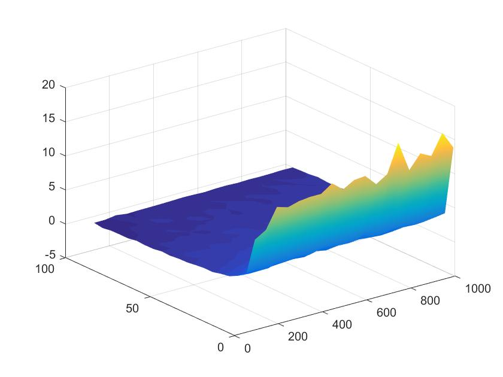

## Curse of diminsionality: 
The distance measure (gamma) stays the same for all number of instances (n). However, as the number of features increases, it becomes harder to differentiate between maximum and minimum distance (gamma approaches zero). This shows the curse of dimensionality that as the number of features grows, the sparsity in the data increases and inference based on the distance becomes infeasible. The same result is observed by using the norm 1 as well which shows that this result is only dependent on the number of features regardless of the method of computing the distance.

## PCA:
Applying PCA to Iris dataset to reduce the dimensionality to two and find the most distinguishable Iris type. 
